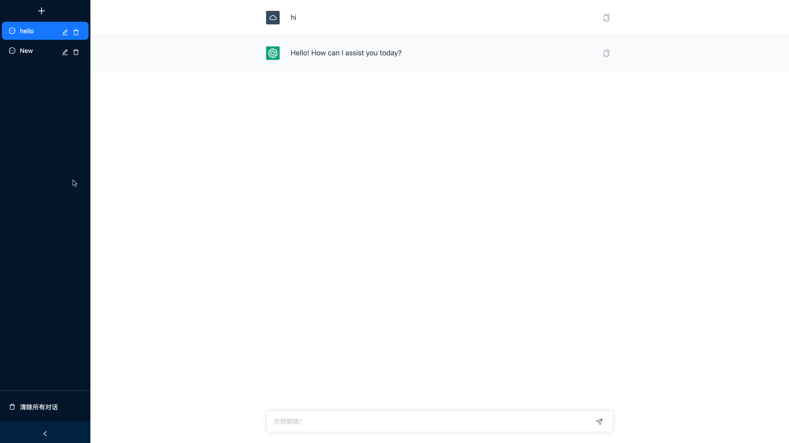

# ChatNG

我是客户端的开发人员，之前没有网页端经验。但是在看到 ChatGPT 的编程能力后，我决定和 ChatGPT 结队编程，开发了一个基于 GPT-3.5 的聊天界面。



## 功能

-   [x] 自定义 OpenAI URL
-   [x] 接入 GPT-3.5 模型
-   [x] 基础聊天界面
-   [x] Markdown 格式支持
-   [x] 聊天数据浏览器保存（因为 Next.js 的服务端渲染机制，这个我还没完全搞清楚，感觉有点问题）

## 使用说明

1. 克隆或下载本项目到本地
2. 进入项目根目录，运行 `yarn install` 安装依赖
3. 在根目录创建 `.env` 文件，可选项：
    ```
    OPENAI_API_KEY=
    HTTPS_PROXY=
    OPENAI_API_BASE_URL=
    ```
4. 运行 `yarn dev` 启动开发服务器
5. 在浏览器中访问 `http://localhost:3000` 查看项目效果

## 感想

ChatGPT 是一个非常有效的工具，它能够极大地提高入门效率，尤其是在解决一般性问题方面。然而，当遇到深入一些的问题时，我发现自己缺乏相关知识，因而难以提出一个良好的 prompt，这导致 ChatGPT 的回答并不能完全满足我的需求。

随着项目的不断推进，我意识到自己需要大量补充 Node.js、Next.js 等网页前端知识，才能重新掌控整个项目。

## 感谢
[ddiu8081/chatgpt-demo](https://github.com/ddiu8081/chatgpt-demo) 项目给我的灵感。

## 版权和许可证

本项目采用 MIT 许可证。详细信息请参考 [LICENSE](LICENSE) 文件。
